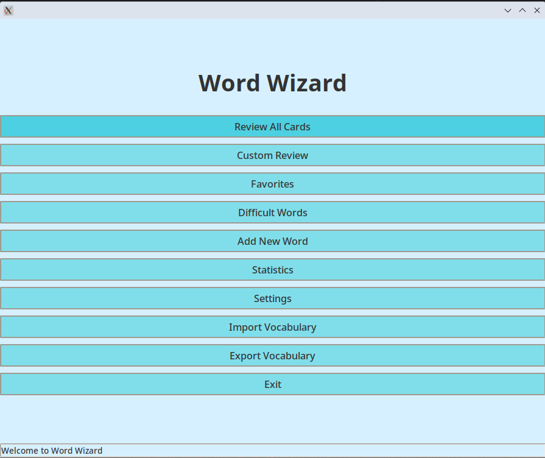
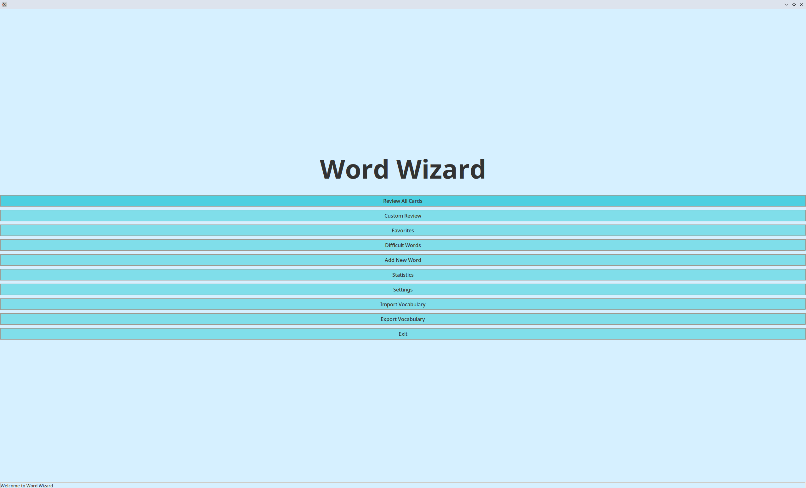
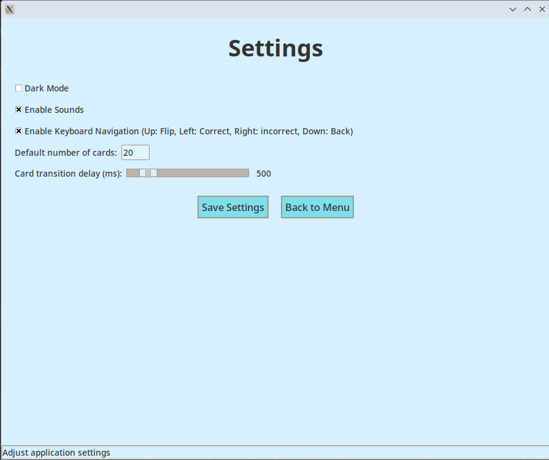
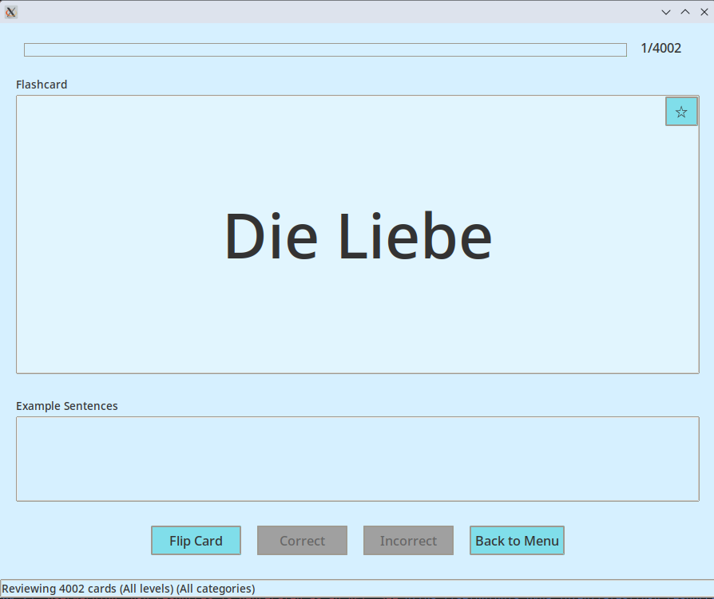
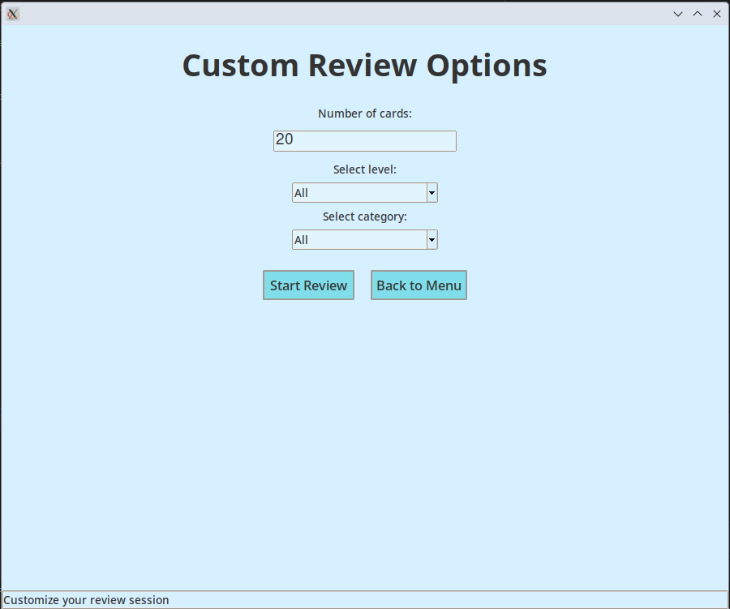
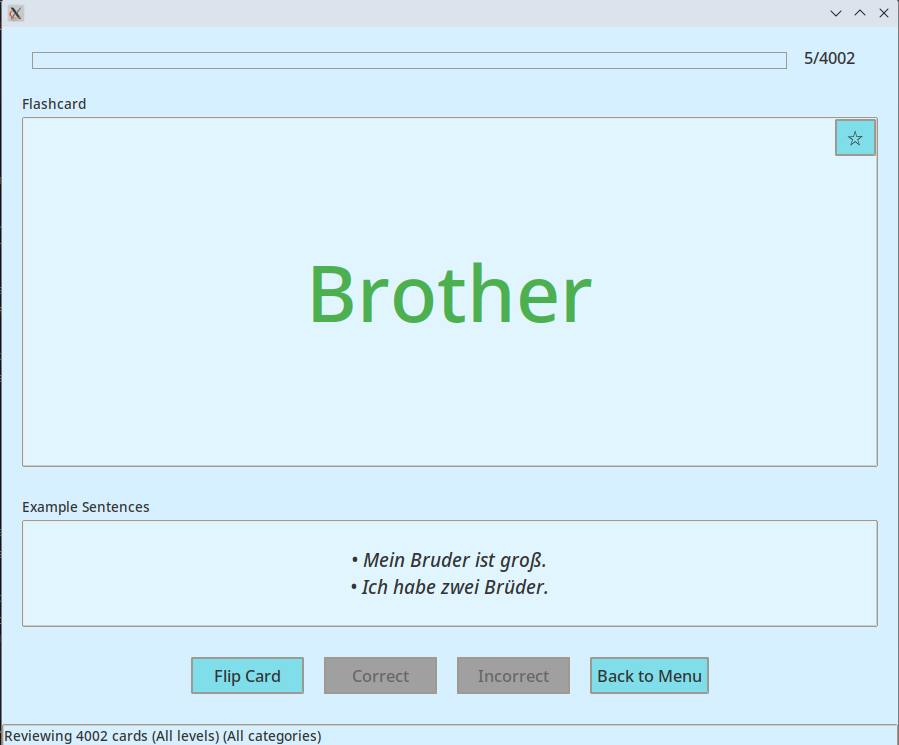
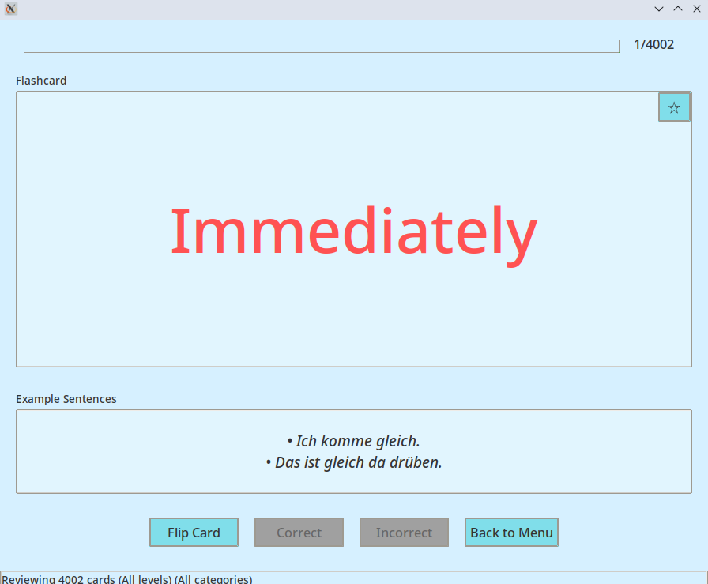
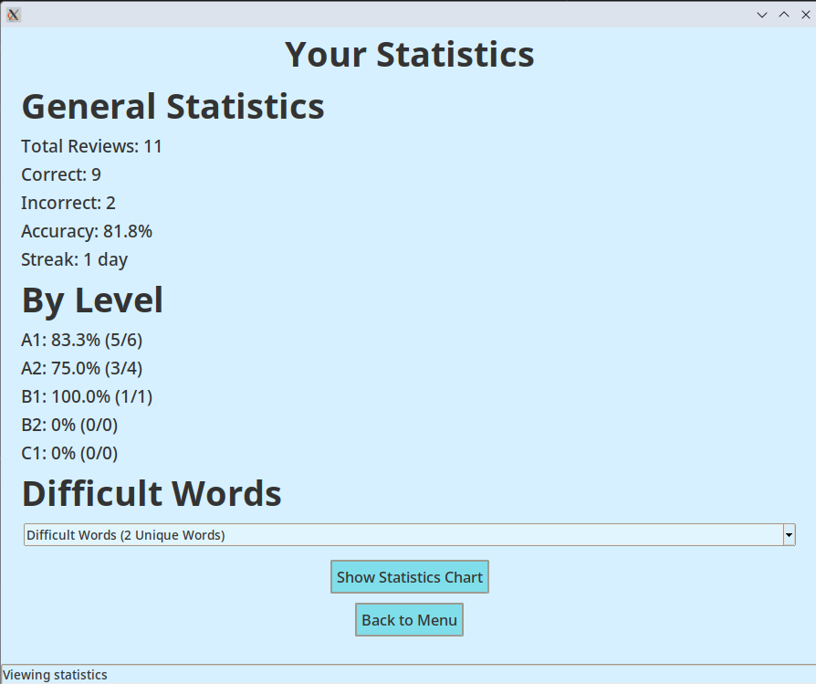
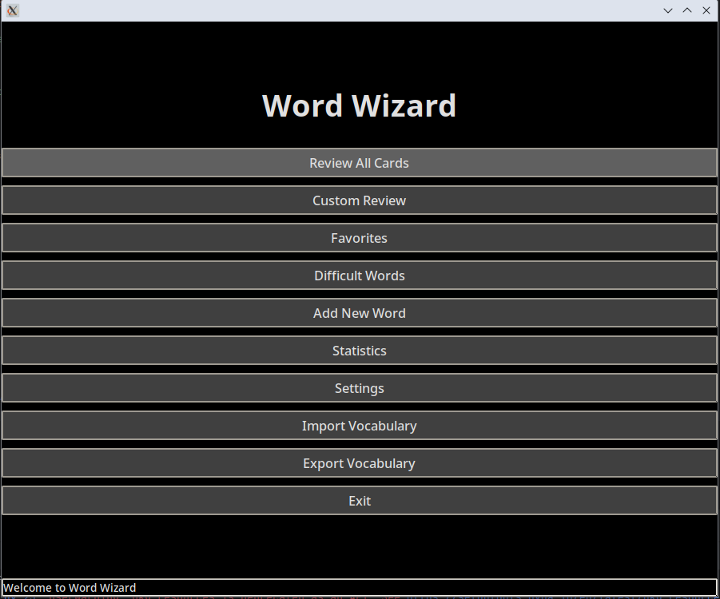
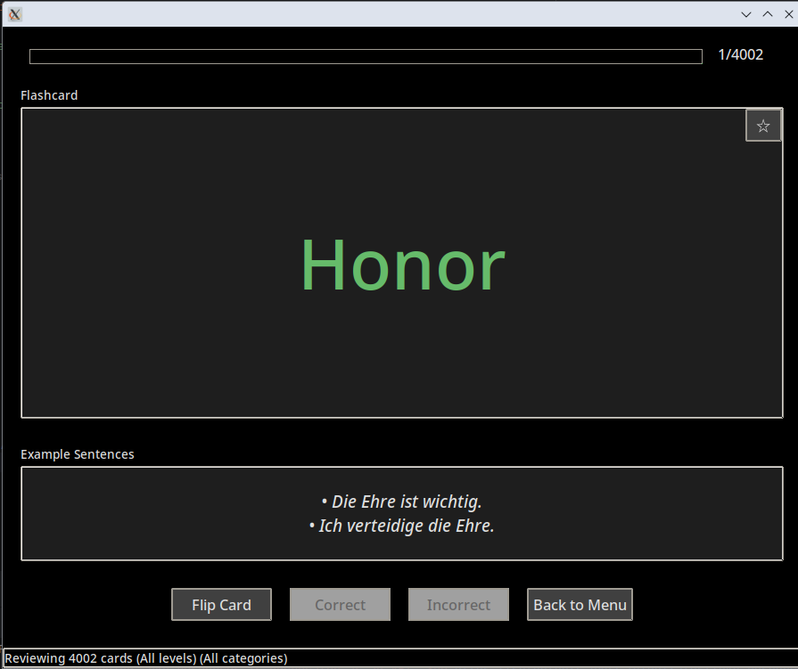

🧠 Flash Card — Advanced German-English Vocabulary Trainer

**Flash Card** is a fully functional German-English flashcard application written in Python with a modern Tkinter-based GUI.
It helps you master vocabulary using the **Leitner system**, supports A1–C1 levels, and includes many smart features like dark mode, stats tracking, and custom study modes.

---

✨ Features

- ✅ **Leitner Box System** (5-box spaced repetition)
- ✅ **Dark Mode** toggle with memory
- ✅ **Real-time statistics**: Accuracy, wrong count, total progress
- ✅ **Study Modes**: Difficult Words, Custom Review, Shuffled Sets
- ✅ **Level & Category Filtering** (A1–C1, Noun, Pronoun etc.)
- ✅ **Sound Effects** for right/wrong interaction and click sound
- ✅ **Sound Effects**: Motivational prompts for every 10-answer streak
- ✅ **Keyboard Support**: 🔼 Up Arrow – Flip / ⬅️ Left Arrow – Correct / ➡️ Right Arrow – Incorrect / **⎋** Escape Key – Back to Menu
- ✅ **Favorites**: List for favorite words
- ✅ **Flashcard Management**: Add / Delete / Edit cards
- ✅ **JSON Import/Export** support
- ✅ **Leitner Reset & Visualization**
- ✅ **No internet required** – Fully offline

---

📸 Screenshots

### Main Navigation & Core Features
These images represent the primary menus and essential functionalities of the application.


*The initial view of the application, showing primary options.*


*An alternative or secondary view of the main menu.*


*The settings screen, where users can customize their experience.*

---

### Review & Practice Modes
These images showcase the different ways users can practice and review their cards.


*The interface for reviewing all available flashcards.*


*Options for users to create a personalized review session.*

---

### Card Management
This section highlights how users interact with individual cards.


*The screen for adding new vocabulary or information.*


*Feedback indicating a correct answer during a review session.*


*Feedback indicating an incorrect answer during a review session.*

---

### Statistics & Progress Tracking
These images display the user's performance and progress.


*Overall statistics and performance metrics for the user.*


*A visual representation of accuracy broken down by different difficulty levels.*

---

### Dark Mode (Thematic Options)
Showcasing the application's appearance in dark mode.


*The main menu displayed in dark mode.*


*The review interface rendered in dark mode.*

---

🧩 Technologies

- **Python 3.12+**
- **Tkinter** (GUI)
- **JSON** (data storage)
- **Pygame** (for sound)

---

🚀 How to Run

### 📦 Option 1: Download Executable

Download the latest `.exe` release directly from the [GitHub Releases page](https://github.com/MathematicianTr/word-wizard/releases).

---

💻 Option 2: Run from Source Code

```bash
git clone [https://github.com/MathematicianTr/word-wizard.git](https://github.com/MathematicianTr/word-wizard.git)
cd word-wizard

# (Optional) Create virtual environment
python -m venv venv
source venv/bin/activate  # On Windows: venv\Scripts\activate

# Install requirement(s)
pip install pygame

# Run the application
python "word_wizard.py"

---

📂 Folder Structure

word-wizard/
├── sounds/
│   ├── correct.wav
│   ├── incorrect.wav
│   ├── streak.wav
│   ├── click.wav
├── data/
│   └── german_flashcards.json
├── backup/
│   └── backup.json
├── screenshots/
│   ├── accuracy_by_level.png
│   ├── add_new_word.png
│   ├── correct.png
│   ├── custom_review.png
│   ├── incorrect.png
│   ├── main_menu.png
│   ├── main_menu_2.png
│   ├── review_all_cards.png
│   ├── settings.png
│   ├── statistics.png
│   ├── dark_mode_main_menu.png
│   └── dark_mode_review_all_cards.png
├── LICENSE
├── README.md
├── icon.svg
└── word_wizard.py

---

📦 Requirements

- Pygame

---

📄 License

This project is licensed under the Umut Kılıç Non-Commercial Public License (UK-NCPL) 1.0.  
See the LICENSE file for full details.

---

👤 Author
Umut Kılıç

[https://github.com/MathematicianTr](https://github.com/MathematicianTr)

---

💡 Future Ideas
- Web version (Flask or Streamlit)

- Switchable languages (EN↔DE)

- SQLite or cloud save support

- Mobile version (Kivy or React Native)

---

🙌 Acknowledgements

- This project was developed with the help of Grokking, determination, and countless cups of tea.

- Special thanks to the Python documentation and the brilliant simplicity of Tkinter.

- Also inspired by the Leitner method and the spirit of open-source language learning.